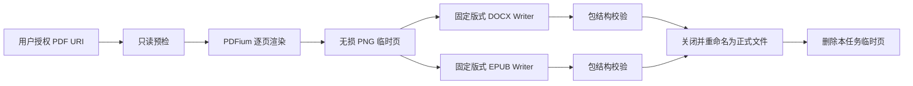

# PDF 原版保真转换器 Android 版设计与开发规范

> 文档版本：0.1  
> 设计日期：2026-09-02  
> 对应桌面版：PDF 原版保真转换器 0.3.0  
> 文档用途：作为 Android 首个可安装版本的产品、技术和验收依据

## 1. 产品结论

Android 版应优先完成一个完全离线、默认保真、适合手机和平板操作的 PDF 转换器：

- PDF → 固定版式 EPUB；
- PDF → 固定版式 DOCX；
- 批量选择 PDF 或扫描用户授权的文件夹；
- 不修改源 PDF；
- 不重新组织文字、表格或图片；
- 不需要 OCR 也能处理纯扫描 PDF；
- 转换过程可以取消，失败时不留下伪装成成品的损坏文件。

“不改变原文结构”的实现方式与桌面版一致：把 PDF 每一页完整渲染成无损 PNG，再将该页作为一个不可拆分的页面写入 EPUB 或 DOCX。该模式保留视觉结构，但文字不能逐字编辑。

## 2. 范围边界

### 2.1 Android 1.0 必须完成

- Android 8.0 及以上，`minSdk 26`。
- `targetSdk 36`；若正式开发时 Google Play 要求发生变化，以当时要求为准。
- 本地选择单个或多个 PDF。
- 通过系统文件选择器授权并扫描一个文件夹。
- 固定版式 EPUB、DOCX 输出。
- 默认 240 DPI、PNG 无损页面图像。
- 混合纸张尺寸、横竖页、扫描页、图片、表格和可打印批注。
- 转换队列、逐文件进度、取消、失败原因和结果页。
- 可直接打开或分享已生成的文件。
- 无网络权限、无账号、无云端上传、无广告和无遥测。

### 2.2 Android 1.0 明确不做

- 不做可编辑 Word 排版承诺。
- 不做 OCR、TXT、全文搜索和翻译。
- 不修改、压缩或覆盖源 PDF。
- 不处理需要密码的 PDF；只显示“当前版本不支持加密 PDF”。
- 不在 APK 内加入 EPUBCheck；EPUBCheck 只在开发和发布检查中运行。
- 不用 RTF、HTML 或改扩展名的方式生成假 `.doc`。

### 2.3 真正 DOC 的处理决定

旧版 `.doc` 是 Microsoft Word 97–2003 二进制格式，而 `.docx` 是 ZIP/XML 格式，两者不能通过改扩展名互换。[Microsoft 的 MS-DOC 规范](https://learn.microsoft.com/en-us/openspecs/office_file_formats/ms-doc/ccd7b486-7881-484c-a137-51170af7cc22)定义了这套二进制结构。

[Apache POI 官方说明](https://poi.apache.org/components/document/index.html)将 HWPF 描述为“有限或不完整”的 DOC 支持，并指出当前没有维护者持续推进 HWPF。它不适合作为“页面图片和结构必须可靠保留”的 Android 写入方案。

因此：

- Android 1.0 的 DOC 选项显示为不可用，并明确写明“手机本地暂不支持真正的 Word 97 DOC，请输出 DOCX”。
- Android 端不得输出假 DOC。
- 如果后续必须支持真正 DOC，首选让用户明确连接自己电脑上的桌面版，由用户电脑中已安装的 Microsoft Word 转换链完成；该能力作为独立项目决策，不进入 Android 1.0。

## 3. 保真定义

### 3.1 必须保持

- PDF 页数和页面顺序；
- 每页宽高比例和横竖方向；
- 文字的视觉位置、字号外观和颜色；
- 表格线、背景色、图片、图表和扫描内容；
- 页面旋转；
- PDF 渲染器能够显示的表单外观和可打印批注；
- 白色页面背景和透明内容的合成结果。

### 3.2 允许出现的显示差异

- 不同阅读器产生的抗锯齿差异；
- 阅读器自身的页边阴影、页面间距和缩放动画；
- 手机屏幕过小时需要双指放大。

### 3.3 不得声称

- 不得声称输出文字可编辑；
- 不得声称 EPUB 可以自动重排且同时保持版式；
- 不得声称所有 PDF 动态内容、视频、JavaScript 或交互表单行为都能保留；
- 不得把“文件能打开”当作“视觉保真通过”。

## 4. 用户体验设计

### 4.1 主页面

```text
┌──────────────────────────────────────┐
│ PDF 原版保真转换器                   │
│ 本地处理 · 源文件只读                │
├──────────────────────────────────────┤
│ [选择 PDF]  [选择文件夹]             │
│                                      │
│ 已选择 3 个 PDF                      │
│  商品目录.pdf              32 页  ×  │
│  扫描资料.pdf              18 页  ×  │
│  横版图册.pdf              12 页  ×  │
├──────────────────────────────────────┤
│ 输出格式                             │
│  ☑ EPUB   ☑ DOCX   ☐ DOC（不可用）  │
│                                      │
│ 版式                                 │
│  ● 原版保真固定版式（推荐）          │
│                                      │
│ 清晰度                               │
│  ● 240 DPI 高保真                    │
│  ○ 160 DPI 较小文件                  │
│  ○ 300 DPI 超清晰                    │
│                                      │
│ 输出位置：转换结果                   │
│ [选择输出文件夹]                     │
├──────────────────────────────────────┤
│        [开始转换 3 个 PDF]           │
└──────────────────────────────────────┘
```

交互规则：

- 首次进入时默认勾选 EPUB 和 DOCX。
- DOC 显示但不可勾选，点按后弹出真实原因和桌面版方案。
- 选择“原版保真固定版式”后，不显示 OCR 语言等无关设置。
- 没有选择来源或输出目录时，开始按钮不可用。
- 开始前显示预计页数和可用空间；空间明显不足时阻止开始。

### 4.2 转换进度页

```text
正在转换 2 / 3

扫描资料.pdf
正在渲染第 11 / 18 页
[███████████─────────] 61%

已完成
✓ 商品目录.epub
✓ 商品目录.docx

[取消当前任务]             [后台运行]
```

- 通知栏显示当前文件、当前页和取消按钮。
- 一次只渲染一页，一次只转换一个 PDF，避免手机内存峰值。
- 用户取消时完成当前写入操作，然后关闭流并删除本次 `.partial` 文件。
- 应用被系统终止后，重新进入时将任务显示为“已中断，可重新开始”，不得把半成品标记为成功。

### 4.3 结果页

每个源 PDF 独立成组显示：

- 打开 EPUB；
- 打开 DOCX；
- 分享；
- 查看保存位置；
- 显示失败格式及具体原因；
- “重新转换”沿用当前设置。

不得自动删除结果，也不得自动打开第三方应用。

## 5. Android 文件访问

使用 Android Storage Access Framework：

- `ACTION_OPEN_DOCUMENT` + `EXTRA_ALLOW_MULTIPLE`：选择多个 PDF；
- `ACTION_OPEN_DOCUMENT_TREE`：选择来源或输出文件夹；
- `takePersistableUriPermission`：仅保存用户明确授予的 URI 权限；
- 读取源文件时只使用 `"r"` 模式；
- 输出只能写入用户选择的目录或应用自己的缓存目录；
- Manifest 不申请 `MANAGE_EXTERNAL_STORAGE`，不申请互联网权限。

系统文件选择器允许用户明确决定应用能访问的文件或目录，而且不需要广泛存储权限，详见 [Android Storage Access Framework 官方说明](https://developer.android.com/training/data-storage/shared/documents-files)。

## 6. 技术选型

| 层 | 方案 | 决定理由 |
|---|---|---|
| 语言 | Kotlin | Android 原生、协程和类型安全 |
| UI | Jetpack Compose + Material 3 | 单 Activity、状态驱动、适配手机/平板 |
| 状态 | ViewModel + StateFlow | 界面状态单一来源，方便恢复和测试 |
| 文件 | ContentResolver + DocumentFile | 支持本地、SD 卡和文档提供器 URI |
| PDF 渲染 | PdfiumAndroid 稳定版 | 与桌面版 PDFium 路线一致，可控制逐页渲染 |
| 图片 | Android Bitmap → PNG | 无损、阅读器兼容性高 |
| DOCX | Kotlin 直接写 OOXML ZIP | 只实现固定页图片所需的最小结构，避免大型 Office 依赖 |
| EPUB | Kotlin 直接写 EPUB 3 ZIP | 与桌面版固定版式结构保持一致 |
| 后台转换 | 用户触发的前台任务 + 协程 | 保持通知和取消能力，避免界面销毁中断 |
| 持久状态 | 小型 JSON 任务清单 | 只保存任务 URI、状态和错误，不引入数据库 |
| 测试 | JUnit + instrumentation + 桌面端格式校验 | 同时验证文件结构和真实显示 |

Android 官方推荐 Compose 使用单向数据流，并由状态持有者向 UI 提供状态，参考 [Compose UI Architecture](https://developer.android.com/develop/ui/compose/architecture) 和 [Android App Architecture](https://developer.android.com/topic/architecture)。

PDF 渲染依赖首选 [PdfiumAndroidKt](https://github.com/johngray1965/PdfiumAndroidKt) 的当前稳定版本；设计时验证版本为 `2.0.3`。正式锁定版本前必须在 4 KB 和 16 KB 内存页设备上运行完整转换测试。Android 15 起支持 16 KB 内存页，包含原生 `.so` 的应用必须验证兼容性，详见 [Android 官方 16 KB 指南](https://developer.android.com/guide/practices/page-sizes)。

不使用 alpha 版 PDF 引擎作为 1.0 发布依赖。

## 7. 软件结构

首版保持单 Gradle `app` 模块，不提前拆分多模块。

```text
app/src/main/java/<package>/
├─ MainActivity.kt
├─ ui/
│  ├─ HomeScreen.kt
│  ├─ ProgressScreen.kt
│  ├─ ResultScreen.kt
│  └─ ConverterViewModel.kt
├─ model/
│  ├─ ConversionOptions.kt
│  ├─ ConversionJob.kt
│  ├─ PageArtifact.kt
│  └─ ConversionResult.kt
├─ files/
│  ├─ DocumentPicker.kt
│  ├─ UriFileAccess.kt
│  └─ OutputDocumentWriter.kt
├─ pdf/
│  ├─ PdfPageRenderer.kt
│  └─ PdfPreflight.kt
├─ convert/
│  ├─ ConversionCoordinator.kt
│  ├─ ForegroundConversionService.kt
│  └─ JobManifestStore.kt
├─ output/
│  ├─ DocxFixedLayoutWriter.kt
│  ├─ EpubFixedLayoutWriter.kt
│  └─ ZipPackageWriter.kt
└─ validation/
   ├─ DocxPackageValidator.kt
   └─ EpubPackageValidator.kt
```

每个类只负责一个明确步骤。`ConversionCoordinator` 不包含 UI 代码，Writer 不读取 PDF，Renderer 不写最终格式。

## 8. 核心数据模型

```kotlin
enum class OutputFormat { EPUB, DOCX }
enum class QualityPreset(val dpi: Int) {
    MOBILE(160), FIDELITY(240), ULTRA(300)
}

data class ConversionOptions(
    val formats: Set<OutputFormat>,
    val quality: QualityPreset = QualityPreset.FIDELITY,
    val outputTreeUri: Uri
)

data class PageArtifact(
    val pageNumber: Int,
    val widthPoints: Float,
    val heightPoints: Float,
    val pngFile: File
)
```

源 URI 与输出 URI 必须分开保存。任何 Writer 都只能收到只读 `PageArtifact` 和新建的输出流。

## 9. 转换流程



### 9.1 预检

1. 使用只读文件描述符打开 PDF。
2. 检查能否打开、页数是否大于零。
3. 读取每页宽高和旋转信息。
4. 若文件加密或需要密码，停止该文件并记录明确错误。
5. 估算输出空间；空间不足时不创建正式结果。
6. 保存任务清单，然后进入逐页渲染。

### 9.2 逐页渲染

- 默认 `240 / 72` 缩放比例。
- 白色背景、ARGB 渲染后转 RGB PNG。
- 开启表单内容和可打印批注渲染。
- PNG 使用无损压缩，不使用 JPEG 或 WebP 有损模式。
- 每页写盘后立即释放 Bitmap、Page 和原生引用。
- 页图命名为 `page-00001.png`、`page-00002.png`。
- 同一个 PDF 严格串行渲染；不并发操作 PDFium 页面对象。

### 9.3 临时文件规则

- 应用缓存：`cacheDir/jobs/<job-id>/pages/`。
- 输出先写成 `<name>.docx.partial` 或 `<name>.epub.partial`。
- Writer 完成、ZIP 可重新打开、必需条目齐全后，才改为正式扩展名。
- 成功或取消后删除本任务页面缓存。
- 只删除应用自己创建并记录在任务清单中的临时文件。

## 10. DOCX 固定版式规范

DOCX Writer 直接生成最小 Open Packaging Conventions 结构：

```text
[Content_Types].xml
_rels/.rels
docProps/core.xml
word/document.xml
word/_rels/document.xml.rels
word/media/page-00001.png
word/media/page-00002.png
```

每个 PDF 页面对应一个 Word section：

- 页面宽高：`points / 72 * 1440` 转为 twips；
- 横向页保留横向宽高；
- 上、下、左、右页边距均为 0；
- 图片宽高等于 section 页面宽高；
- 图片使用相对 page 的 `wp:anchor`，位置为 `(0, 0)`；
- `distT/distB/distL/distR = 0`；
- `wrapNone`；
- 每页仅一个锚定图片，不插入多余段落或空白页；
- Word 页面任一边超过 22 英寸时，整体等比缩小，不能裁切。

内部校验至少包括：

- ZIP 可以重新打开；
- `[Content_Types].xml` 和关系文件存在；
- section 数量、锚定图片数量、媒体数量均等于 PDF 页数；
- 每张内嵌 PNG 的摘要与渲染器输出一致；
- 最终文件能由 Microsoft Word Android 或桌面 Word 打开。

## 11. EPUB 固定版式规范

EPUB 必须符合 EPUB 3：

```text
mimetype                         # ZIP 第一项且不压缩
META-INF/container.xml
OEBPS/content.opf
OEBPS/nav.xhtml
OEBPS/styles.css
OEBPS/page-00001.xhtml
OEBPS/images/page-00001.png
```

`content.opf` 必须包含：

```xml
<meta property="rendition:layout">pre-paginated</meta>
<meta property="rendition:orientation">auto</meta>
<meta property="rendition:spread">none</meta>
```

每个 XHTML 页面：

- 只引用一张对应 PNG；
- viewport 宽高等于 PNG 像素宽高；
- `html`、`body` 无边距；
- 图片铺满 viewport，并使用 `object-fit: contain`；
- 一个 PDF 页面对应一个 spine `itemref`。

[W3C EPUB Reading Systems 3.3](https://www.w3.org/TR/epub-rs-33/)规定 `pre-paginated` 每个 spine item 生成一页，`rendition:spread=none` 不组成双页展开并使用居中的单 viewport，正好对应手机上的“一页一屏 + 缩放”阅读方式。

发布前所有 EPUB 必须通过 [W3C EPUBCheck](https://github.com/w3c/epubcheck)，验收要求为 0 fatal、0 error、0 warning。

## 12. 任务状态

```text
QUEUED
  ↓
PREFLIGHT
  ↓
RENDERING
  ↓
WRITING_EPUB / WRITING_DOCX
  ↓
VALIDATING
  ↓
COMPLETED

任意处理中状态 → CANCELLED / FAILED / INTERRUPTED
```

- `FAILED` 必须记录用户可读原因和内部错误类型。
- 单个格式失败不删除其他已经成功并校验的格式。
- 任务恢复只能重新开始该 PDF，不能猜测半个 ZIP 是否可续写。

## 13. 错误提示

| 情况 | 用户提示 |
|---|---|
| PDF 无法打开 | 文件不是有效 PDF，或文件已经损坏 |
| 加密 PDF | 当前版本不支持需要密码的 PDF |
| 输出目录失去权限 | 请重新选择输出文件夹 |
| 空间不足 | 可用空间不足，转换尚未开始 |
| 渲染页失败 | 第 N 页无法渲染，本文件未生成完整结果 |
| EPUB/DOCX 包校验失败 | 输出文件校验失败，未保留不完整文件 |
| 用户取消 | 已取消；已完成且校验通过的其他文件仍保留 |
| DOC 被点按 | Android 本地暂不支持真正的 Word 97 DOC，请选择 DOCX |

## 14. 隐私和权限

- 所有转换在设备本地完成。
- Manifest 不声明 `INTERNET`。
- 不读取联系人、照片库、位置、设备标识或剪贴板。
- 只访问用户通过系统文件选择器授权的 URI。
- 不记录文件内容、文件名或路径到分析服务。
- 日志只保留任务 ID、页码、阶段和错误码；用户主动导出诊断时才生成日志文件。
- 分享结果必须由用户点按系统分享按钮触发。

## 15. 无障碍和移动端适配

- 所有按钮提供明确的 TalkBack 标签。
- 进度不只使用颜色表达。
- 支持系统字体放大到 200%，关键按钮不能被遮挡。
- 支持深色模式，但页面预览保持 PDF 自身颜色。
- 手机使用单栏；宽屏和平板使用左侧任务列表、右侧设置或结果的双栏布局。
- 屏幕旋转后保留选择、设置和进度，不重新启动任务。

## 16. 验收测试

### 16.1 基准 PDF

测试集必须至少包含：

1. A4 纵向：文字、表格、嵌入图片；
2. A4 横向：图表、图片、旋转文字；
3. 4×6 英寸自定义尺寸扫描页；
4. 一个文件中混合纵向、横向和不同尺寸；
5. 透明图片、可打印批注和 AcroForm 外观；
6. 100 页文档；
7. 损坏 PDF、加密 PDF、零可用空间和权限被撤销场景。

### 16.2 自动验收

- 转换前后源 URI 的内容摘要一致。
- PDF 页数 = PNG 数量 = EPUB XHTML 数量 = DOCX section 数量。
- EPUB 和 DOCX 内嵌 PNG 与渲染器输出逐字节一致。
- EPUB 的 `mimetype` 是第一项且不压缩。
- EPUB 固定版式三项元数据存在。
- DOCX 页面宽高、方向和原 PDF 对应。
- 输出 ZIP 关闭后可以重新打开并读取所有条目。
- 取消和失败不留下正式扩展名的半成品。
- 100 页转换全程只保留当前页或受控缓存，不发生 OOM。

### 16.3 真实设备与阅读器验收

- API 26 低配模拟器或真实设备；
- Android 12；
- Android 15/16 的 4 KB 与 16 KB 内存页环境；
- ARM64 真机；
- 竖屏手机、横屏手机和平板；
- Microsoft Word Android 打开 DOCX；
- 至少两个支持 EPUB 3 固定版式的 Android 阅读器打开 EPUB；
- 每个输出逐页检查页数、方向、裁切、空白页和图片错位。

## 17. 发布门槛

Android 1.0 APK/AAB 只有同时满足以下条件才能发布：

- 所有自动测试通过；
- 基准 PDF 的 EPUBCheck 为 0 错误、0 警告；
- DOCX 在 Word Android 和桌面 Word 中页数、方向、比例正确；
- 16 KB 环境下 PDFium 可加载并完成转换；
- Manifest 确认没有互联网权限和广泛文件访问权限；
- Release 构建已签名，升级安装不丢失用户授权记录；
- 安装、转换、取消、打开结果、升级和卸载均做过真实设备测试。

## 18. 开发阶段与停止点

### 阶段 A：应用骨架与 PDF 渲染

- Compose 三个页面；
- SAF 文件和目录选择；
- PDFium 逐页 PNG；
- 混合尺寸预览；
- 16 KB ABI 验证。

验收：三页基准 PDF 在真机上生成三张尺寸正确的 PNG。未通过不得进入 Writer 开发。

### 阶段 B：EPUB

- 固定版式 EPUB Writer；
- 包内校验；
- EPUBCheck CI；
- 手机阅读器测试。

验收：基准 EPUB 0 错误、0 警告，三页均无裁切。

### 阶段 C：DOCX

- 最小 OOXML Writer；
- 每页独立 section 和锚定图片；
- Word Android/桌面 Word 回读测试。

验收：页数、方向、页面尺寸和嵌入 PNG 全部匹配。

### 阶段 D：批量、后台和发布包

- 队列、进度、取消、通知和中断恢复；
- 大文件、低空间和权限撤销测试；
- Release APK/AAB；
- 安装、升级、卸载验证。

验收：完成第 17 节全部发布门槛后停止。不要自行加入 OCR、账号、云同步或 DOC 桥接。

## 19. 后续版本候选

以下内容不属于 Android 1.0，必须单独确认后才能开发：

- 通过用户自己的 Windows 电脑生成真正 DOC；
- 离线 OCR 与 TXT；
- 可编辑文字 DOCX/EPUB；
- 内置 PDF/EPUB 阅读器；
- 页面范围选择；
- 输出清晰度和文件体积的高级估算。

## 20. 最终成功标准

用户在 Android 手机上选择 PDF 和输出目录后，不安装 Python、Microsoft Word 或 OCR 软件，就能离线得到可在移动端打开的 EPUB 和 DOCX；源 PDF 未被写入，输出的每一页与 PDF 渲染结果一一对应，没有重排文字、丢失图片、改变页序、横竖方向错误或额外空白页。
